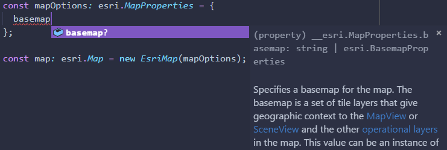

# Types for ArcGIS API

This sample provides a boilerplate for standing up an Angular app that implements the ArcGIS API for JavaScript.  We leverage the Angular CLI and the [esri-loader](https://github.com/Esri/esri-loader).

## Overview

- [Esri provides type definitions](https://github.com/Esri/jsapi-resources/) for the ArcGIS API for JavaScript

- For Esri v4.x, install them with

  ```bash
  npm install --save @types/arcgis-js-api
  ```

  and also add to `tsconfig.app.json`.

  ```json
  "types": ["arcgis-js-api"]
  ```

- Types are available through global "`__esri`" namespace for Esri v4.x

  - We recommend renaming to "`esri`" with

  ```ts
  import esri = __esri;
  ```

- More info is available at https://github.com/Esri/jsapi-resources/

  ```ts
  // without
  const map = new EsriMap({ /* zoom, center, etc. */ });

  // with
  const mapProperties: esri.MapProperties = {
    basemap: 'streets'
  };
  const map: esri.Map = new EsriMap(mapProperties);
  ```

  ```ts
  // without
  const arrayOfGraphics = [];
  const myGraphic = new Graphic({ /* geometry, symbol, etc. */ });
  arrayOfGraphics.push(myGraphic)

  // with
  const arrayOfGraphics: esri.Graphic[] = [];
  const myGraphic: esri.Graphic = new Graphic({ /* geometry, symbol, etc. */ });
  arrayOfGraphics.push(myGraphic);
  ```

- Example of IntelliSense in VS Code

  

## Background info on this sample code

This sample app was created following the instructions here: https://github.com/Esri/angular-cli-esri-map.

Please spend some time getting comfortable with those instructions.
